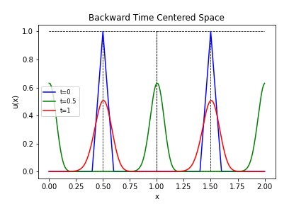
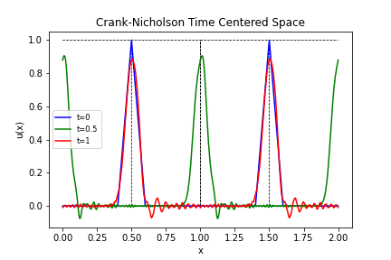
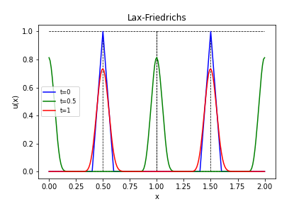
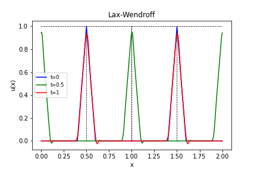
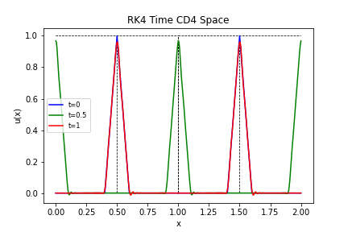

<h3 align="center">Advanced Numerical Analysis HW 3</h3>

  <p align="center">
    Code for solving a periodic one dimensional linear hyperbolic problem over two spatial periods.
  </p>
</div>

<!-- GETTING STARTED -->
## Getting Started

The code requires Python to be installed on the machine.

### Prerequisites

The modules required in Python are
* tabulate
  ```sh
  pip install tabulate
  ```
* numpy
  ```sh
  pip install numpy
  ```
* scipy
  ```sh
  pip install scipy
  ```
* matplotlib
  ```sh
  pip install matplotlib
  ```

### Installation

1. Simply download HW3.py or HW3nb.pynb and run in your favorite Python environment
2. Install required modules

## Examples
We solve the baby wave equation $u_t=u_x$ with periodic boundary conditions over the interval $[0,1]$ and display the solution at time $t=0,0.5,1$. For each problem we chose a spatial step size of $\frac{1}{200}$ and a time step size of $\frac{1}{226}$.

#### Backward Time and Centered Space (BTCS):

<a href="https://github.com/Shlorki/NumericalHW2">
  
</a>

#### Crank_Nicholson Time and Centered Space (CNCS):

<a href="https://github.com/Shlorki/NumericalHW2">
  
</a>

#### Lax-Friedrichs (LaxFried):

<a href="https://github.com/Shlorki/NumericalHW2">
  
</a>

#### Lax-Wendroff (LaxWend):

<a href="https://github.com/Shlorki/NumericalHW2">
  
</a>

#### RK4 in Time and Compact Differences in Space (RK4/CD4):

<a href="https://github.com/Shlorki/NumericalHW2">
  
</a>

<p align="right">(<a href="#readme-top">back to top</a>)</p>
